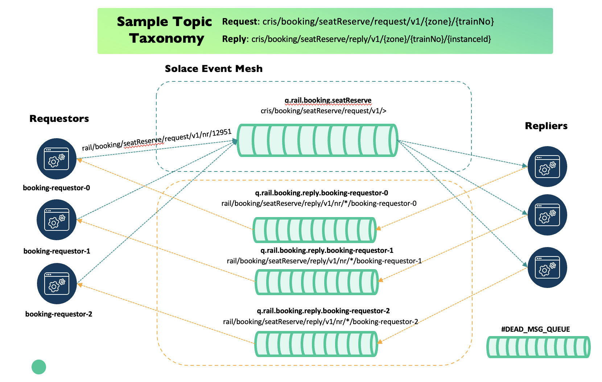

# Solace Spring Boot Request/Reply

Request/reply over **Solace** using **Spring Boot and JCSMP** (Solace's Java client library), with
guaranteed delivery and no Spring Cloud Stream layer. The worked example throughout this document
is a train seat reservation service.

> This is sample code, not an officially supported Solace product. If you adopt it, copy it into
> your own package and take ownership of it.

**Contents:** [Overview](#1-overview) · [How the library is built](#2-how-the-library-is-built) ·
[Core concepts](#3-core-concepts) · [Configuration](#4-configuration) ·
[Coming from Spring for Kafka](#5-coming-from-spring-for-kafka) ·
[Endpoints](#6-endpoints) · [Known gaps and future work](#7-known-gaps-and-future-work)

---

## 1. Overview

[Solace](https://solace.com) is a message broker: one application publishes a message, and another
receives it, without either needing to know the other exists. Solace's own Spring Boot starter,
`solace-java-spring-boot-starter`, makes it easy to connect a Spring Boot application to a Solace
broker — it wires the connection up as a Spring bean and reconnects automatically if it drops.

What that starter doesn't give you is a **request/reply programming model**: a way to send a
message and get a typed answer back, matched to the specific request that produced it. That's a
common pattern — one service asking another to do something and waiting for the result — common
enough that Spring's Kafka integration ships it as a first-class feature: `ReplyingKafkaTemplate
.sendAndReceive(...)` on the side making the request, `@KafkaListener` plus `@SendTo` on the side
answering it. Solace has no equivalent of its own. Every team that has wanted this pattern on
Solace has had to build it by hand: matching a reply to the right waiting caller, handling a reply
that never arrives, and routing the reply back to whoever asked.

This library is that missing layer. It is built to feel like Spring Kafka's request/reply support
on purpose — if you have used `ReplyingKafkaTemplate`, most of the API here will already look
familiar. The rest of this document covers how the library is put together (§2), the concepts you
need to use it correctly (§3), how to configure it (§4), how it compares to Spring Kafka in more
detail (§5), and a few practical tools and caveats (§6–§7).

To see it running rather than reading about it, the [booking-demo](booking-demo/README.md) module
is a complete, guided walkthrough — starting a broker, building the demo, and making your first
booking — built on top of this library. To use the library in your own application instead,
[TUTORIAL.md](TUTORIAL.md) builds the same round trip up step by step, with the code for each
piece.

---

## 2. How the library is built

### Module map

The library lives in `solace-request-reply-core/`, organized by responsibility:

| Package | What lives there |
|---|---|
| `api/` | The public surface: `ReplyingSolaceTemplate` (send a request, get a reply back), `@SolaceListener` (mark a method as a request handler), and `SolaceHeaders`. |
| `core/` | The template's implementation: the store that matches an incoming reply to the request — and the caller — waiting for it, the timeout watcher that gives up on a request that waited too long, and the code that turns Java objects into message payloads and back. |
| `endpoint/` | Creates and manages the actual Solace queues the library needs: the reply queue, the request queue, and the dead message queue. |
| `transport/` | The lower-level plumbing underneath all of that: the Solace session itself, the component that publishes messages and tracks whether the broker confirmed them, and the component that receives messages off a queue. |
| `listener/` | Finds every `@SolaceListener`-annotated method at startup and wires each one to its own queue and its own background thread pool. |

### Architecture



Two kinds of process take part: **requestors**, which send requests and wait for replies, and
**repliers**, which receive requests and answer them. A single process can be both at once — that's
the common case — or you can run separate requestor-only and replier-only processes; see
`reply.enabled` in [§4](#4-configuration).

Requests all go to **one shared queue** that every replier instance consumes from. Any replier can
handle any request, so the broker spreads the work across however many replier instances happen to
be running — that's what makes adding more repliers a way to scale.

Replies go to **a separate queue for each requestor instance**. The `CompletableFuture` waiting for
a particular reply lives in the memory of one specific running process, and no other process can
complete it on that process's behalf — so a reply has to be delivered to the one instance that is
actually waiting, not shared out to whichever instance happens to be free.

### An end-to-end flow example

Concretely, here is everything that happens for one request, from the call to the answer:

1. Your code calls `template.sendAndReceive(topic, request, ReplyType.class, timeout)`.
2. The library generates a correlation id for this request (see [§3.1](#31-correlation-id)) and
   remembers it, paired with the `CompletableFuture` your call is waiting on.
3. It publishes the request to the topic you gave it. Because of how topics are mapped onto queues
   (see [§3.2](#32-topics-wildcards-and-topic-to-queue-mapping)), that message lands on the shared
   request queue.
4. Whichever replier instance the broker hands it to (see [§3.3](#33-request-queues-vs-reply-queues))
   receives it on a background thread.
5. That replier's `@SolaceListener`-annotated method runs, with the request's payload passed in.
6. When the method returns — and it is annotated with `@SendTo` — the library builds a reply
   message, stamps it with the same correlation id, and publishes it to the topic the original
   request said to reply to. It waits for the broker to confirm the reply is safely stored before
   doing anything else (see [§3.5](#35-acknowledgements)).
7. That reply topic maps onto the *requestor's own* reply queue, which only that one instance is
   subscribed to (see [§3.3](#33-request-queues-vs-reply-queues) again).
8. The requestor's reply-side listener receives the message, reads its correlation id, finds the
   matching `CompletableFuture` from step 2, and completes it — which is what makes the original
   `sendAndReceive(...)` call resolve with a typed reply.

If something goes wrong at any point in that chain — the request never gets picked up, the replier
crashes mid-way, the reply never arrives — that is what [§3.4](#34-ttls-redeliveries-and-timeouts)
and [§3.6](#36-dead-message-queues) cover.

---

## 3. Core concepts

Six ideas make up the whole system. Each one gets its own section below, but they lean on each
other — the flow in §2 is really these six things working together.

### 3.1 Correlation ID

Every request carries a **correlation id**: a unique value stamped on the request and echoed back
on its reply, carried in a native Solace message field (`SolaceHeaders.CORRELATION_ID`) rather than
in the payload itself. It exists because a single process can have many requests in flight at once,
replies can arrive in a different order than the requests were sent, and — because of the two-queue
design in [§3.3](#33-request-queues-vs-reply-queues) — a reply could in principle come from any
replier instance. The correlation id is what lets the library work out which of the many things it
might be waiting for, a given reply actually belongs to.

It has a second job, in your own handler code: a natural **idempotency key**. Guaranteed delivery
(see [§3.4](#34-ttls-redeliveries-and-timeouts)) is *at-least-once*, which means the same request
can genuinely be delivered and processed twice — for example, if a replier reserves a seat and then
crashes before acknowledging the request, the broker hands it to another replier instead of losing
it. A handler that records the correlation id alongside the result the first time, and checks for it
before doing the work again, turns that at-least-once *delivery* into an exactly-once *effect* — no
seat reserved twice — for a small amount of code. See `SeatInventoryService.reserveOnce` in the demo
for a worked example; in a real service, the reservation and that record belong in one database
transaction with a unique constraint on the correlation id.

`request.sequence-numbers` (default `true`) stamps a second, monotonic value on top of the
correlation id — a plain counter, not a substitute for it. Because replies genuinely can arrive out
of order, a gap or a reorder in that counter is what a load test or a diagnostic tool checks for, to
tell "reordered" apart from "lost" without needing the correlation id's own uniqueness guarantee.

### 3.2 Topics, wildcards, and topic-to-queue mapping

A **topic** is just a string that a message is published to — a name, not an object that has to be
created ahead of time. Topics here follow the pattern `Domain/Noun/Verb/Version/Properties`, with
properties ordered from lowest to highest cardinality:

```
Request   rail/booking/seatReserve/request/v1/{zone}/{trainNo}
Reply     rail/booking/seatReserve/reply/v1/{zone}/{trainNo}/{instanceId}
```

Two wildcard characters let a subscriber match more than one exact topic. `*` matches exactly one
level of the topic (and can be used as a prefix within a level, so `trn*` matches `trn123`). `>`
matches one or more trailing levels, and only works as a wildcard as the last level.

| Subscription | What it gives you |
|---|---|
| `…/request/v1/>` | one pool of repliers handles every booking |
| `…/request/v1/nr/>` | shard by zone, so this pool only handles Northern Railway |
| `…/request/v1/*/12951` | tap a single train while investigating an incident |
| `…/reply/v1/nr/*/client-0` | one instance's replies, replacing a hostname selector |
| `…/reply/v1/nr/12951/>` | every reply for one train, across all instances |

**Topic-to-queue mapping.** A queue, on its own, has no topic — publishing to a topic and consuming
from a queue are two different mechanisms, and something has to connect them. That connection is a
**subscription**: telling the broker "route anything published to this topic onto that queue." This
library sets that up for you at startup, turning every topic you list in `replier.topics` into a
subscription on the request queue, so a message published to any of those topics lands there without
you touching the broker directly. The reply side works the same way, just per-instance: each
requestor subscribes its own reply queue to its own reply topic.

If you have used a JMS selector to route replies by hostname before, this is the Solace-idiomatic
replacement — put the discriminator in the topic instead of evaluating an expression per message:

```diff
- consumer:
-   selector: "hostname = '${HOSTNAME}'"
+ # The instance id is a topic level, so the broker only sends what this instance asked for.
+ rail/booking/seatReserve/reply/v1/nr/*/client-0
```

One consequence worth knowing: the replier never needs to know how the reply topic is structured —
it only ever echoes the `replyTo` value carried on the request. The *requestor* is the one that
built that concrete topic in the first place, because it already knows values like the train number,
and it subscribes once using a wildcard in that position:

```
subscription   rail/booking/seatReserve/reply/v1/nr/*/client-0
reply-to       rail/booking/seatReserve/reply/v1/nr/12951/client-0
```

That also means the train number is visible in the topic itself, so you can distinguish traffic per
train — filter it, tap it during an incident — without parsing any payload. Configure which values
appear this way with
`reply.per-request-placeholders` and a matching `per-request-placeholder-expressions` entry. Listing
a placeholder with no expression renders that topic level as `unknown` — the subscription still
matches, so nothing breaks, but that piece of information is lost.

Not every placeholder needs to vary per request, though. `reply.placeholders` is the static
counterpart — a fixed value, such as `zone: nr`, resolved once at startup and substituted into every
reply topic and the reply queue name alike, rather than re-evaluated against each request's payload.

### 3.3 Request queues vs. reply queues

| | Request queue | Reply queue |
|---|---|---|
| How many | one, shared by every replier | one per requestor instance |
| Who can bind to it | many repliers at once (non-exclusive) | exactly one flow at a time (exclusive) |
| How work is distributed | the broker load-balances across whichever repliers are connected | not applicable — every message is addressed to one specific instance |
| Why | any replier can answer any request, so this is what makes horizontal scale-out safe | the waiting `CompletableFuture` lives in one process's memory, so the reply has to reach that exact process |

The request queue's "many repliers at once" behavior is `replier.access-type: NON_EXCLUSIVE`, the
default and what scale-out needs. Setting it to `EXCLUSIVE` flips that: only one bound flow is ever
active at a time, and every other instance sits as an idle standby the broker fails over to only if
the active one disconnects — a hot/cold pair rather than a load-balanced pool.

Each queue also has a spool quota — `reply.quota-mb` (default `100`) for the reply queue,
`replier.provision.quota-mb` (default `5000`) for the request queue — capping how much unconsumed
data the broker will hold for it before rejecting further publishes. Size these for how large a
backlog you expect to tolerate, not just steady-state traffic: a stalled replier or a slow requestor
can spool a real backlog before either timeout or redelivery limits catch up.

The reply queue is durable (it survives a broker restart) and named after the requestor instance —
`q….reply.{instanceId}` — which makes `reply.instance-id` a value worth setting deliberately rather
than accepting whatever default falls out of the environment. It defaults to the hostname, which is
the pod name on Kubernetes, and two failure modes follow from getting this wrong, neither of which
announces itself:

- **Two instances resolving to the same id** bind the same exclusive queue. The second becomes a
  standby that receives nothing, and every one of its requests simply times out with no error
  logged anywhere. Set `reply.instance-id` explicitly when running more than one instance on a host.
- **An id that changes between runs** strands the previous queue on the broker, still spooling
  replies nobody will ever read. The hostname is stable across a restart, which is why the default
  no longer carries a random suffix.

The resolved value is always logged at startup, so it is never a guess:

```
Reply endpoint identity: instanceId=pod-0 queue=q.rail.booking.reply.pod-0
```

On startup, `waitForReplyEndpoint()` blocks for up to `reply.wait-for-endpoint` (default `10s`) for
the reply queue to be provisioned, subscribed, and bound before letting the application proceed —
the analogue of Spring Kafka's `waitForAssignment`. Publishing a request before that window closes
would have nowhere for the reply to land; a warning is logged, not a startup failure, if the endpoint
still isn't ready when the timeout elapses, since a broker under load may simply need longer.

**A replier-only process should not have a reply queue at all.** It only ever consumes the shared
request queue and publishes each reply to the topic the request asked for — it is never itself the
target of a reply. Set `reply.enabled: false` on such a process; this removes the reply queue, the
requestor-side template, and the reply-path health indicator, and the process says so at startup.

### 3.4 TTLs, redeliveries, and timeouts

Three related but different clocks are running on every request:

- **`request.timeout`** is how long *your calling code* is willing to wait for a reply before giving
  up. It governs the `CompletableFuture` your call gets back — nothing on the broker.
- **The request's own TTL** (time-to-live) governs how long the *message itself* is allowed to sit
  on the broker's queue before the broker gives up on it, entirely independent of whether a replier
  has already picked it up — see [§3.6](#36-dead-message-queues) for why that independence matters.
  By default it equals `request.timeout` (`request.ttl-matches-timeout`), so a request never
  outlives the caller's own patience; a hard-coded, unrelated TTL would risk the opposite.
- **`replier.provision.max-redelivery`** bounds how many times the broker will hand an
  unacknowledged (or actively failed) request to a replier before giving up on it for good. Zero
  means "redeliver forever," which lets one malformed message loop indefinitely — the default is 3.

Two more request-queue settings govern what happens at each of those clocks' edges:

- **`replier.provision.respects-ttl`** (default `true`) is what makes the request's own TTL, above,
  actually take effect on the request queue. Turning it off has the broker ignore the TTL the
  publisher set, so a request can sit on the queue past the deadline the requestor already gave up
  at — the queue equivalent of `request.ttl-matches-timeout` being pointless without this also on.
- **`replier.provision.discard-notify-sender`** (default `true`) has the broker tell the *publisher*
  when one of its messages is discarded from this queue — expired or over `max-redelivery` — rather
  than only ever surfacing as a plain client-side timeout. This is what lets a requestor eventually
  distinguish "discarded" from "still might arrive" instead of always waiting out the full
  `request.timeout` either way.

By default, when a handler throws anything other than `RetryableHandlerException`, the request is
treated as **done, badly**: the exception becomes an error reply, and the message is acknowledged —
the broker will never redeliver it.

- **What gets built as the reply:** if a `SolaceListenerErrorHandler` bean is configured for this
  listener, it runs first and can return a value to publish as a normal-looking reply instead. If
  there isn't one — or it rethrows — the reply carries the exception's own message, flagged as an
  error.
- **What the caller sees:** its `CompletableFuture` fails immediately with `RemoteErrorException`,
  carrying that message. This is a deliberate fail-fast: the requestor learns about the failure
  right away instead of waiting out its own `request.timeout` for a reply that was never coming.
- **The side effect:** because the message is acknowledged, this is final. There is no redelivery,
  no second attempt — right for a failure that a retry can't fix, like a validation error or a
  business rule violation. Wrong for one that might succeed a moment later, like a database
  connection blip: that turns a momentary hiccup into a booking the customer is told never happened.

**For a failure you want retried, throw `RetryableHandlerException` instead.** This skips the reply
and the error handler entirely, and settles the message `FAILED` rather than acknowledging it — an
*active* request to the broker to redeliver, as opposed to leaving the message unacknowledged, which
only redelivers if the connection drops and reconnects, not on demand. The broker retries the
handler up to `replier.provision.max-redelivery` times before giving up and moving the message to
the dead message queue.

What that does *not* do:
- **It doesn't buy the caller more time.** The original `CompletableFuture` still expires on its own
  `request.timeout`, no matter how many redeliveries happen behind it — this only helps if a retry
  succeeds before that clock runs out.
- **It doesn't bypass the message's own TTL.** By default the message TTL equals `request.timeout`,
  so it can expire off the queue mid-retry before `max-redelivery` is even reached. Raise
  `request.timeout` if a handler genuinely needs more retry budget than one fast attempt gives it.

| | Default (any other exception) | `RetryableHandlerException` |
|---|---|---|
| Settlement | Acknowledged — done | `FAILED` — active redelivery request |
| Reply published? | Yes (via error handler, or a generic error) | No |
| Caller sees | `RemoteErrorException`, immediately | Nothing, until either a retry succeeds or `request.timeout` elapses |
| Redelivery? | Never | Up to `max-redelivery`, then DMQ |
| Use for | Failures a retry can't fix (validation, business rules) | Failures that might succeed on retry (transient errors) |

Replies carry a TTL too (`replier.reply-ttl`, defaulting to `request.timeout`), for the same reason:
a reply is only useful to the one requestor instance whose future is still waiting, and past that
deadline nothing can complete it. Set it to `0s` to disable expiry and keep replies forever, at the
cost of an undeliverable one accumulating on the reply queue instead of being cleaned up.

### 3.5 Acknowledgements

**Acknowledging** a message is telling the broker "I'm done with this — you don't need to keep it or
try delivering it again." Until a message is acknowledged, the broker holds onto its own copy, ready
to redeliver it if the process handling it disappears before finishing. Getting this right is what
makes guaranteed delivery actually guarantee anything.

`@SolaceListener(ackMode = ...)` chooses who decides a request is done, and when: `CLIENT` (the
default) or `AUTO`.

**`CLIENT`** — the library acknowledges the request itself, and only after two things have both
happened: the reply has been published, *and* the broker has confirmed it is safely stored.

- **If the process crashes before that point,** the broker's copy is still there, unacknowledged,
  so it gets redelivered instead of silently lost.
- **The same active-redelivery mechanism covers two more cases from [§3.4](#34-ttls-redeliveries-and-timeouts):**
  a handler that throws `RetryableHandlerException`, and a reply that fails to publish. Neither
  leaves the request merely unacknowledged — both actively settle it `FAILED`, which is what
  triggers redelivery on demand rather than only on the next reconnect.

**`AUTO`** — JCSMP acknowledges on your behalf, the instant the handler method returns — confirmed
against a live broker, not just assumed from documentation — regardless of what that handler
actually did. That has two consequences, not one:

- **It blocks the whole process, not just its own queue.** Every flow in a session shares one JCSMP
  delivery thread, so an `AUTO` handler has to run directly on that thread rather than on this
  library's own per-listener thread pool, the way `CLIENT` handlers do. A slow `AUTO` handler stalls
  delivery to every other listener and every reply in the process for as long as it takes to return.
- **It has no failure path at all.** The mechanism that makes `CLIENT`'s active redelivery possible
  — settlement outcomes, in JCSMP's terms — is a CLIENT-ack-only capability, confirmed against
  Solace's own documentation. A `RetryableHandlerException`, or a reply that fails to publish,
  cannot force a redelivery under `AUTO`: JCSMP has already decided to acknowledge the message by
  the time either of those runs, and nothing the handler does can change that afterward.

| | `CLIENT` (default) | `AUTO` |
|---|---|---|
| Who acknowledges, and when | This library, after the reply is published *and* confirmed | JCSMP, the instant the handler method returns |
| Handler runs on | This listener's own thread pool | JCSMP's shared dispatch thread — blocks every other listener while it runs |
| Crash before ack | Redelivered | Already acknowledged — lost |
| `RetryableHandlerException` / failed reply-publish | Actively redelivered ([§3.4](#34-ttls-redeliveries-and-timeouts)) | No effect — the message is already acknowledged |
| Best for | Anything that replies, or needs a real failure path | A fast handler with no reply that can tolerate an occasional silent loss |

### 3.6 Dead message queues

A request that exhausts its redeliveries, or whose TTL expires, would otherwise simply be **deleted**
by the broker — a lost booking with no trace it ever existed. A **dead message queue (DMQ)** is a
holding pen for exactly those messages instead of a silent deletion, and it's on by default, because
the alternative is silent loss:

```yaml
solace:
  request-reply:
    dmq:
      enabled: true               # mark messages eligible and provision the queue
      name: "#DEAD_MSG_QUEUE"     # the Message VPN default, which every queue already points at
    request:
      dmq-eligible: true          # flag on published requests
    replier:
      dmq-eligible: true          # flag on published replies
```

- **There is one shared DMQ by default** — every queue already points at it out of the box.
- **Routing to a different DMQ is a broker-side setting** (`deadMsgQueue` on the source queue), not
  something this client library can set. `dmq.name` only controls what this library provisions and
  reports on — not where messages actually go. Changing the real routing needs a direct SEMP call
  against the broker.
- **A mismatch between the two surfaces as a startup warning**, not silence — so if you do repoint
  the routing via SEMP, that's where to check it took effect.
- **`dmq.provision`** (default `true`) creates the DMQ at startup if it's missing — turn it off if
  it's provisioned out of band, in which case nothing is verified, because a client without
  management visibility cannot tell "missing" from "just not visible to me."
- **`dmq.quota-mb`** (default `1000`) is the DMQ's own spool quota, independent of the request and
  reply queues' quotas in [§3.3](#33-request-queues-vs-reply-queues). It is provisioned with
  `respectsMsgTTL=false` regardless of any other setting — these messages are here *because* they
  expired, and honoring their TTL again would expire them straight back out of the one place they're
  meant to survive.

What actually ends up there is less obvious than it looks, and worth knowing before you go looking
for a message that isn't:

| Situation | Dead-lettered? |
|---|---|
| Request expires on the queue with no replier consuming it | yes |
| Request already delivered to a replier, still waiting behind other work when its TTL elapses | yes — **the replier can go on to finish the work anyway** |
| Request redelivered past `max-redelivery` — a replier crashing before it acknowledges | yes |
| Reply published, requestor already gone, `reply-ttl` elapsed | yes |
| Handler throws `RetryableHandlerException` | after `max-redelivery` redeliveries — **yes**; before that, redelivered, not yet |
| Handler throws anything else | **no** — that becomes an error reply, and the request is acknowledged |

The second row is the one worth sitting with. Confirmed against a live broker, not assumed: a
message delivered to a client and left unacknowledged — exactly what happens while it waits its turn
in a busy handler pool — is still dead-lettered at its TTL deadline regardless. The broker does not
check delivery state before discarding its own copy.

- **A handler can finish and produce a real effect** (a reserved seat) for a request that is
  *simultaneously* sitting in the DMQ, looking exactly like one that was never processed at all —
  **a DMQ entry is not proof the work never happened.**
- **Replaying a DMQ'd message must reuse its original correlation id.** That's what the idempotency
  guard in [§3.1](#31-correlation-id) needs to recognize it as a repeat. Assigning a fresh id will
  not be caught, and produces a second, genuine booking for one that already succeeded.

One broker-version difference affects all of this: on **10.25.10 and later**, *all* messages removed
from a queue go to the DMQ by default; on **10.25.9 and earlier**, only messages the publisher
explicitly marked eligible are moved. Setting `dmq-eligible` (on by default) is what makes the
behavior the same on both, rather than depending on which broker you happen to be running.

To look inside the DMQ directly:

```bash
curl -s -u admin:admin \
  'http://localhost:8085/SEMP/v2/monitor/msgVpns/default/queues/%23DEAD_MSG_QUEUE/msgs' | jq
```

`GET /api/diagnostics/endpoints` (§6) also reports a `dmq` block with `configuredEnabled` and
`established` reported separately, since dead-lettering can be switched on in configuration and
still be inert — a queue that failed to provision means the broker falls back to deleting.

### 3.7 Backpressure

Two independent problems, one on each side of a request, both about what happens when work arrives
faster than it can be drained.

**Requestor side: unbounded in-flight requests.** Every `sendAndReceive` call registers a
`CompletableFuture` in an in-memory correlation store, keyed by correlation id, until a reply
arrives or `request.timeout` elapses — enforced by a background reaper sweeping the store every
`request.reaper-sweep-interval` (default `100ms`). Left uncapped, a traffic burst or a stalled
replier grows that store to roughly `arrivalRate × timeout` entries before the reaper catches up —
accepted silently, with no signal to the caller that it should slow down.

`request.max-pending` (default `0`, unbounded) caps how many requests this instance will have in
flight at once. Past the cap, `sendAndReceive` fails immediately with `RequestBackpressureException`
instead of registering — a fast, typed signal to retry or shed load, rather than an ever-growing map
of futures each waiting on a reply that may never come.

**Replier side: an unbounded handler queue.** A `CLIENT`-ack `@SolaceListener`'s handler runs on a
per-listener thread pool, off the JCSMP dispatch thread ([§3.5](#35-acknowledgements)). Left
unbounded, a handler that cannot keep up with delivery does not slow the broker down at all — every
request keeps landing in this process's heap as a queued task holding the raw message, with nothing
to bound how far that grows.

`replier.backpressure.*` bounds that handoff queue and, once it fills to `pause-at-queue-depth`,
pauses the listener's own flow(s) so the backlog accumulates on the broker's durable queue instead —
visible, monitored, and already governed by `replier.provision.max-redelivery` and the DMQ
([§3.6](#36-dead-message-queues)) — rather than invisibly in this process's memory. Delivery resumes
once the backlog drains to `resume-at-queue-depth`. A message that still arrives after the queue is
genuinely full (the broker's in-flight window did not drain in time to see the pause) is settled
`FAILED` — the same active-redelivery mechanism [§3.4](#34-ttls-redeliveries-and-timeouts) covers —
rather than accepted unconditionally. `AUTO`-ack listeners are unaffected: their handler already
runs inline on the dispatch thread, which is self-throttling by construction.

| Property | Default | Meaning |
|---|---|---|
| `request.max-pending` | `0` (unbounded) | Cap on concurrent in-flight `sendAndReceive` calls. Over the cap, fails fast with `RequestBackpressureException`. |
| `request.reaper-sweep-interval` | `100ms` | How often the timeout reaper checks the correlation store for expired requests. Lower = faster failure, more frequent scanning. |
| `request.reaper-max-staleness` | `5s` | How long the reaper's last sweep may go stale before `/actuator/health` reports the reply path DOWN — see below. |
| `replier.backpressure.enabled` | `true` | Master switch for the handler-queue bound and flow pause/resume, for `CLIENT`-ack listeners. |
| `replier.backpressure.queue-capacity` | `0` → `2 × concurrency` | Hard cap on the handoff queue. A message rejected past this is settled `FAILED`. |
| `replier.backpressure.pause-at-queue-depth` | `0` → `queue-capacity` | Queue depth at which this listener's flow(s) pause. |
| `replier.backpressure.resume-at-queue-depth` | `0` → `queue-capacity / 2` | Queue depth at which paused flow(s) resume. |

```yaml
solace:
  request-reply:
    request:
      max-pending: 500              # 0 = unbounded (default)
    replier:
      backpressure:
        enabled: true
        queue-capacity: 0            # <=0 => 2 * concurrency
        pause-at-queue-depth: 0      # <=0 => queue-capacity
        resume-at-queue-depth: 0     # <=0 => queue-capacity / 2
```

**Observability.** `GET /actuator/health` reports `pendingRequests` and `reaperHealthy` under the
reply-path indicator, and per-listener `queueDepth`/`backpressureEngaged` under the session
indicator (§6). A listener pausing under load is expected, deliberate control flow, not a fault, so
it is reported as a detail rather than flipping the indicator DOWN — only a reaper that has stopped
sweeping altogether (past `request.reaper-max-staleness`) does that, since a correlation store that
has stopped bounding itself is exactly the failure this whole mechanism exists to prevent, only
silent instead of observable.

---

## 4. Configuration

Settings split across two namespaces. `solace.java.*` is the connection itself — host, credentials,
reconnect behavior — and belongs to the official `solace-java-spring-boot-starter`; this library
adds nothing there. Everything this library owns lives under `solace.request-reply.*`.

This is enough to send and receive:

```yaml
solace:
  java:
    host: tcp://localhost:55565
    msg-vpn: default
    client-username: default
    client-password: default

  request-reply:
    request:
      timeout: 5s
    reply:
      topic-pattern: "my/service/reply/v1/{instanceId}"
      queue-name-pattern: "q.my.service.reply.{instanceId}"
    replier:
      queue: q.my.service.requests
      topics:
        - "my/service/request/v1/>"
```

Everything else has a default, chosen so a first run against a fresh broker works with nothing
provisioned by hand: the reply queue, the request queue, and the dead message queue are all created
if they do not already exist (see `provision-mode` below to turn that off).

A handful of settings are worth deciding deliberately rather than leaving at their default:

| Setting | Default | Why it matters |
|---|---|---|
| `enabled` | `true` | Master switch for the whole library. `false` creates none of its beans — no session wiring beyond what `solace-java-spring-boot-starter` itself does, no listeners, no `ReplyingSolaceTemplate`. |
| `reply.enabled` | `true` | Set `false` on a replier-only process — see [§3.3](#33-request-queues-vs-reply-queues). |
| `reply.instance-id` | hostname | Must be unique per instance and stable across restarts — see [§3.3](#33-request-queues-vs-reply-queues). |
| `request.ttl-matches-timeout` | `true` | Bounds how long an undelivered request can wait — see [§3.4](#34-ttls-redeliveries-and-timeouts). |
| `replier.provision.max-redelivery` | `3` | Zero means redeliver forever — see [§3.4](#34-ttls-redeliveries-and-timeouts). |
| `java.reconnect-retries` | — | Set to at least 100 with a 3000&nbsp;ms wait, giving the 300 seconds needed to survive an HA failover. The commonly copied value of 20 only gives 60 seconds. |
| `dmq.enabled` | `true` | Turning it off restores silent discard of failed messages — see [§3.6](#36-dead-message-queues). |
| `replier.reply-ttl` | follows `request.timeout` | Set `0s` to keep replies forever, at the cost of orphaned queues growing — see [§3.4](#34-ttls-redeliveries-and-timeouts). |
| `replier.backpressure.enabled` | `true` | Bounds a `CLIENT`-ack listener's handoff queue and pauses its flow(s) under load instead of buffering unbounded work in memory — see [§3.7](#37-backpressure). |
| `request.max-pending` | `0` (unbounded) | Caps concurrent in-flight `sendAndReceive` calls; over the cap fails fast with `RequestBackpressureException` — see [§3.7](#37-backpressure). |

`replier.provision.mode` and `reply.provision-mode` each accept two values:

- **`CREATE_IF_MISSING`** (the default) — creates the queue if it doesn't already exist. If it does
  exist with different properties than requested, JCSMP raises an error naming exactly which
  property differs, rather than silently accepting the drift or silently overwriting it.
- **`OFF`** — never creates or reconciles anything; the queue must already exist. Use this on a
  message VPN whose client profile forbids creating endpoints, and provision the queue out of band
  first.

There's no third "validate but never create" mode, because JCSMP itself has none to offer:
`provision()` creates a missing endpoint unconditionally, flag or no flag — verified against a live
broker, not assumed from documentation; see [spike/README.md](spike/README.md). That's what makes
`CREATE_IF_MISSING` safe to leave on even against an already-provisioned queue — the drift check
above, not avoiding the creation call, is what actually protects you.

Three places to look for anything not covered here:

| File | What it is |
|---|---|
| [docs/configuration-reference.yml](docs/configuration-reference.yml) | Every property the library reads, with its default and an explanation. Start here for anything not covered above. |
| [booking-demo/src/main/resources/application.yml](booking-demo/src/main/resources/application.yml) | A complete, working configuration with real values, used by the demo. |
| `docs/config.json.example` | Template for broker credentials. Copy to `config.json`, which is gitignored. |

---

## 5. Coming from Spring for Kafka

| Spring Kafka | This library |
|---|---|
| `ReplyingKafkaTemplate` | `ReplyingSolaceTemplate` |
| `sendAndReceive(...)` returning `RequestReplyFuture` | same names |
| `getSendFuture()` returning `SendResult` | `getSendFuture()` returning `PublishResult` |
| `@KafkaListener(topics = …)` | `@SolaceListener(queue = …, topics = …)` |
| consumer `groupId` | `queue`, since a non-exclusive queue is the consumer group |
| `@SendTo` | `@SendTo`, Spring's own annotation |
| `KafkaHeaders.CORRELATION_ID` | `SolaceHeaders.CORRELATION_ID`, a native message field |
| `spring.kafka.*` | `solace.java.*` and `solace.request-reply.*` |

### Differences that matter

| Concept | Kafka behavior | Solace behavior |
|---|---|---|
| Ordering | guaranteed within a partition | the queue preserves order; this library does not. `@SolaceListener(concurrency)` sizes this listener's own handler pool as well as its flow count, so replies can complete out of order the moment it is above 1 — even with a single flow. Set it to `1` for a listener that needs strict ordering; beyond that, give an ordered stream its own queue, since queues are cheap in Solace. |
| Provisioning | you provision topics | the reverse. Topics are just strings and need no setup, while queues are objects with permissions — see [§3.2](#32-topics-wildcards-and-topic-to-queue-mapping). |
| Replay | messages are retained by time or size, and you can seek | a queue drains as messages are acknowledged. Reprocessing needs the separate Message Replay feature. |
| Rebalancing | partitions are reassigned in a stop-the-world rebalance | messages are distributed one at a time across the bound flows. Adding an instance takes effect immediately, with no rebalance. |
| Filtering | topic names are flat, so consumers filter in the application | topics are hierarchical and the broker filters per message — see [§3.2](#32-topics-wildcards-and-topic-to-queue-mapping). |
| Dead letters | a client-side recoverer republishes to a `.DLT` topic | the broker moves messages to a dead message queue itself, with no client code involved. On by default here; see [§3.6](#36-dead-message-queues). |
| Queue browsing | not applicable | a queue can be browsed non-destructively, which is how you inspect the DMQ. |
| Acknowledgement | `AckMode.RECORD` and friends layer commit-after-processing over a raw `enable.auto.commit` that is really commit-on-a-timer | `@SolaceListener(ackMode = "CLIENT")` (the default) acks after processing, the same idea as `AckMode.RECORD`; `AUTO` hands acking to JCSMP itself and gives up more than the name suggests — see [§3.5](#35-acknowledgements). |
| `@SendTo` destinations | supports SpEL, `#{...}` and `!{...}`, to compute a reply topic from the record | not supported, deliberately — see [§7](#7-known-gaps-and-future-work). |

---

## 6. Endpoints

These are the demo application's REST endpoints — a way to exercise the library over HTTP — not
part of the library's own API surface, which is `ReplyingSolaceTemplate` and `@SolaceListener`.

| Endpoint | Purpose |
|---|---|
| `POST /api/bookings` | one reservation, with a latency breakdown |
| `POST /api/bookings` with `"simulate"` | `timeout`, `remote-error` or `slow-handler`, to reproduce each failure mode |
| `GET /api/diagnostics/endpoints` | what was actually provisioned, rather than what was configured |
| `GET /api/diagnostics/reply-path` | whether this instance's reply path is bound and subscribed |
| `GET /actuator/health` | session and endpoint state, including pending-request count, reaper health, and per-listener backlog ([§3.7](#37-backpressure)) |

---

## 7. Known gaps and future work

Honest limitations, by design or not yet addressed:

- **`ackMode = AUTO` has no failure path.** As covered in [§3.5](#35-acknowledgements), JCSMP's
  settlement outcomes — the mechanism behind active redelivery — are a CLIENT-ack-only capability.
  There is no way, today or in principle within JCSMP, for an `AUTO` listener to force a redelivery
  on failure. This is documented rather than hidden, but it means `AUTO` should be a deliberate,
  narrow choice, not a default reached for out of habit.
- **No published Maven coordinate yet.** The library is
  `com.solace.samples:solace-request-reply-core:0.1.0-SNAPSHOT` and isn't published to Maven
  Central or any other repository, so consuming it from another project currently means cloning
  this repository and running `mvn install` locally first, rather than pasting a dependency block
  that resolves immediately.
- **`@SendTo` does not support SpEL** (`#{...}` or `!{...}`), unlike Spring Kafka. This is
  deliberate rather than an oversight: the reason Kafka needs SpEL there — computing a reply
  destination from the record, because a Kafka record has no built-in reply-to — doesn't apply
  here, since this library already carries a dynamic reply-to on every request (see
  [§3.2](#32-topics-wildcards-and-topic-to-queue-mapping)). Using either syntax fails context
  startup with a clear error rather than silently misrouting replies.
- **Idempotent replay is entirely the application's responsibility.** The library gives you the
  correlation id (see [§3.1](#31-correlation-id)) and guarantees at-least-once delivery, but it
  does not itself deduplicate, store, or replay anything — that is left to handler code like
  `SeatInventoryService.reserveOnce`. A pluggable idempotency hook, so a handler could opt into
  automatic deduplication without writing that logic itself, is a plausible future addition rather
  than something this library does today.
- **This document and `booking-demo/README.md` still overlap in places.** This rewrite removed the
  clearest duplication (the demo-running walkthrough that used to open this document, and now lives
  only in the demo's own README), but the demo's step-by-step walkthrough still re-explains a few
  concepts — like why the dead message queue is provisioned with `respectsMsgTTL=false` — that are
  now covered here in [§3.6](#36-dead-message-queues) instead. A full pass to make the demo's
  walkthrough link back here rather than re-deriving these explanations hasn't been done yet.

---

## Tests

```bash
./mvnw test        # starts a broker with Testcontainers
```

Every test in the suite is an integration test that runs against a real broker rather than a mock,
because the behavior that matters here is specifically the interaction with the broker — a mocked
one would not catch the problems these are written to catch.

| Test | What it checks |
|---|---|
| `RequestReplyIntegrationTest` | a round trip; the send future resolving independently of the reply; one request producing exactly one unit of work despite three competing flows; a replayed correlation id not repeating the work; 60 concurrent requests correlated correctly; a timed-out request being evicted |
| `ReplyPathReconnectIntegrationTest` | replies still arrive after the connection is cut from outside using SEMP, with no re-establish logic in play — which is what a durable, broker-side subscription buys |
| `ProvisionDriftIntegrationTest` | re-provisioning with identical properties is a no-op; differing properties raise `PropertyMismatchException`; the ignore flag only suppresses "already exists" |
| `ReplierOnlyIntegrationTest` | with `reply.enabled=false` the context starts, has no reply endpoint or template, still binds the request queue, and provisions no reply queue on the broker |
| `ReplyProvisionModeIntegrationTest` | `reply.provision-mode: OFF` adopts a pre-provisioned reply queue without trying to reconcile it; `CREATE_IF_MISSING` fails clearly on drift instead of silently accepting it |
| `RetryableHandlerExceptionIntegrationTest` | a handler that throws `RetryableHandlerException` is actively redelivered, then dead-lettered once redeliveries are exhausted |
| `ReplyPublishFailureIntegrationTest` | a reply that fails to publish settles the request FAILED so it redelivers, instead of being silently acknowledged and lost |
| `SendToSpelRejectionIntegrationTest` | a Kafka-style SpEL `@SendTo` value fails context startup with a clear message instead of silently misrouting replies |
| `MinimalConfigIntegrationTest` | the minimal configuration shown in [§4](#4-configuration) actually round-trips, so the example cannot rot |
| `DmqIntegrationTest` | the DMQ is provisioned at startup; an expired request is kept there rather than deleted, carrying the published eligibility flag; reply TTL derives from `request.timeout` unless set |
| `ErrorHandlerRoutingIntegrationTest` | `@SolaceListener(errorHandler = "…")` selects a handler by bean name, and two handler beans in one context no longer break startup |
| `PerListenerConcurrencyIntegrationTest` | each `@SolaceListener` gets its own handler pool, so a slow handler on one listener cannot starve another |

The tests use `GenericContainer` rather than the Testcontainers Solace module. The module rejects
`default` as a client username, and does not set `container=docker` or a large enough shared memory
size; without those two settings this broker image fails its platform check and exits. Readiness is
determined by a successful client login, because the management API starts answering well before
the message VPN accepts connections.

If your Docker host is already running other brokers, the suite may time out waiting for its own
container to become healthy.

## Layout

```
solace-request-reply-core/     the reusable library — see §2 for the package-by-package map
booking-demo/                  the runnable sample
docker/                        local broker
spike/                         the provisioning experiment and its result
```

## Licence

Apache 2.0.
